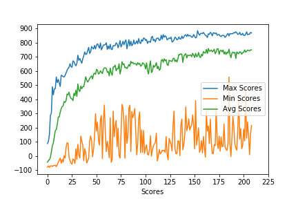

# Replicating the World Model in Pytorch

## Introduction
My goal for this article is to understand the implementation of the World Model Paper by David Ha, Jürgen Schmidhuber and create an implementation in Pytorch.


## References
Paper: https://arxiv.org/abs/1803.10122

Implementation: https://github.com/hardmaru/WorldModelsExperiments

## Setup
Clone github Repository

```git clone https://github.com/hdilab/world_model_experiments.git```

Change directory

```cd world_model_experiments/pytorch_implementation ```

Create a Conda Environement.

``` conda create –name pytorch python=3.7 pip```

During my experimentation I found that when using multi processing in Pytorch there is a huge speed benefit when building pytorch from source.

Follow this guide to install Pytorch from source.

```https://github.com/pytorch/pytorch#from-source```
Install Other Dependencies

```pip install cma```

```pip install gym```

```pip install gym[Box2D]```

```pip install tensorflow-gpu```

```pip install jupyter```

```pip install matplotlib```

```pip install opencv-python```

Training
Call process.bash

```sh process.bash```

The script process.bash does the following tasks sequentially:

Disable GPU for extraction as we will make use of all the processors on the machine to ssample from the environment in parallel.
Run generate_data.py to generate the data. This script will make use of all the processors on the machine to sample from the Car Racing environment and generate 10000 episodes of 1000 timesteps each. It will do so by generating random parameters for each processor. The code is setup so that we can later convert it into an iterative process.
Enable the GPUs to speed up VAE and RNN training.
Run train_vae.py to train the VAE to learn to encode each observation into a latent vector of size 32.
Call series.py to encode all the initially sampled data into the latent representation.
Call train_rnn. This will use the state and action as the input and the next state will be its target output. This will train it to predict the future state.
Disable the GPUs again for the Evolutionary Strategy.
Call train_v_m_c_pepg.py to use an evolutionary strategy to take the current state and hidden state from the rnn and optimize the parameters to maximize the score.

## Results
After 200 iteratoins we recieved a score of 820 ± 153 over 100 random trials. We could probably improve this by training the RNN some more. I also found that since we used a random policy to generate the training data we could use an iterative process to generate much better training examples to train the MDN RNN on.




## Citation
If you find this project useful in an academic setting, please cite:

@incollection{
  ha2018worldmodels,
  title = {Recurrent World Models Facilitate Policy Evolution},
  author = {Ha, David and Schmidhuber, J{\"u}rgen},
  booktitle = {Advances in Neural Information Processing Systems 31},
  pages = {2451--2463},
  year = {2018},
  publisher = {Curran Associates, Inc.},
  url = {https://papers.nips.cc/paper/7512-recurrent-world-models-facilitate-policy-evolution},
  note = "\url{https://worldmodels.github.io}",
}
