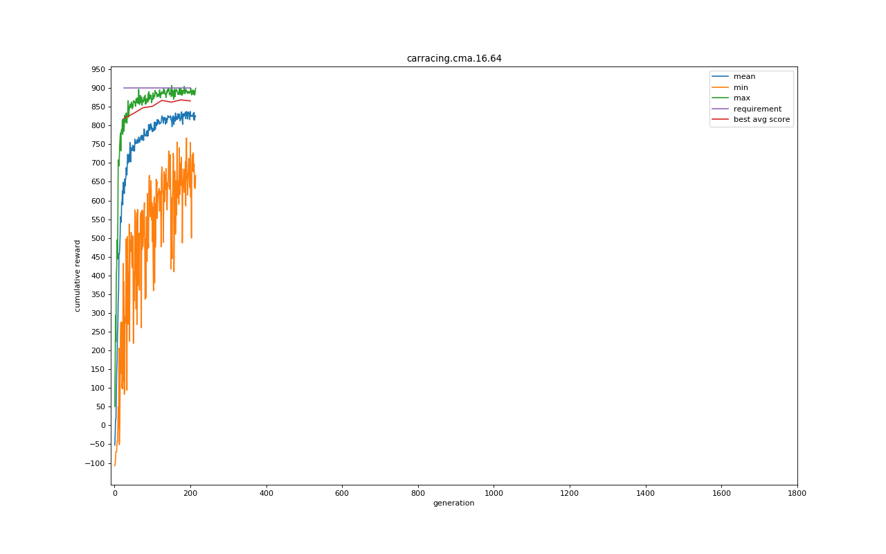

# Introduction

This is a very simple walk through on how to replicate the world model paper. 

#### Trained Model


#### Setup

Create a conda environment

```
conda create --name worldmodel python=3.5.4
```

Activate the Environment
```
conda activate worldmodel
```

Install dependencies
```
conda install -c anaconda pip

conda install tensorflow-gpu=1.8.0

conda install -c theochem cma

conda install -c anaconda mpi4py

conda install -c anaconda jupyter

conda install -c akode gym

pip install gym==0.9.4

pip install gym[box2d]==0.9.4
```

Additional Dependencies

These dependencies are required to avoid an issue with earlier versions of scipy and pillow

```
pip install cython

conda install -c anaconda scipy=1.1.0

conda install -c anaconda pillow

conda install -c conda-forge pyglet
```


#### Extract data to train the VAE and MDM-RNN
Modify extract.bash to disable GPU. Since we are running 64 instances parallely if we do not do this step, each 
process will try to create the model on the GPU. As they cannot share memory it will run out very quickly. 
To do so add the following line at the beginning of extract.bash

```
set CUDA_VISIBLE_DEVICES=-1
```

Finally run the command
```
sh ./extract.bash
```

#### Running on a device with less computing power

If running on a device with a lower number of cores we can still generate all the samples.
In order to do se we need to change the bash script by reducing the number of parallel threads to say 8.
We could then use a wait command and then rerun the loop as many times as we want.


```
for j in `seq 1 4`;
do
    for i in `seq 1 16`;
    do
      echo worker $i
      # on cloud:
      xvfb-run -a -s "-screen 0 1400x900x24 +extension RANDR" -- python extract.py &
      # on macbook for debugging:
      #python extract.py &
      sleep 1.0
    done
    wait
done
```

Instead of using a lower number of files we can instead modify the code to not load all the files in memory while training the VAE.
To do so Comment the following lines from line 65 onwards

#dataset = create_dataset(filelist)

# split into batches:
#total_length = len(dataset)
#num_batches = int(np.floor(total_length/batch_size))
#print("num_batches", num_batches)

# Divide File list into group of 5000.
# Process each group. Will take slightly longer but will not require so much memory

Add the following line to dive the file list into chunks. You could reduce the size even further than 5000.
file_lists_chunks = [filelist[i * 5000:(i + 1) * 5000] for i in range((len(filelist) + 5000 - 1) // 5000)]

Finally add an extra loop on line 90 to iterate through the chunks and create the datasets.
for file_list in file_lists_chunks:
    dataset = create_dataset(file_list, len(file_list), 1000)
    total_length = len(dataset)
    num_batches = int(np.floor(total_length/batch_size))
    np.random.shuffle(dataset)


#### Train VAE and MDM-RNN
To do so execute the command
```
sh ./gpu_jobs.bash
```

For this script we do not want to disable the GPU. It will train the VAE and then train the Mixture Density Network.

#### Train Controller

Copy the trained files to the following directories

```
cp vae.json vae/

cp initial_z.json initial_z/

cp rnn.json rnn/
```

Again we will be running on 64 threads so disable the GPU by add the following line to gce_train.bash.
```
set CUDA_VISIBLE_DEVICES=-1
```

Train the Controller
```
sh ./gce_train.bash
```


#### Visualize the results
Run the Jupyter notebook plot_training_progress.ipynb

You can then visualize the trained model by running the following command

```
python model.py render log/carracing.cma.16.64.best.json
```

You can also save a video of the agent playing the game by adding a gym Monitor Wrapper to the environment in env.py.
In make_env you can add the following line.
```
env = gym.wrappers.monitoring.Monitor(env, 'video', force=True)
```


Visualizing training


